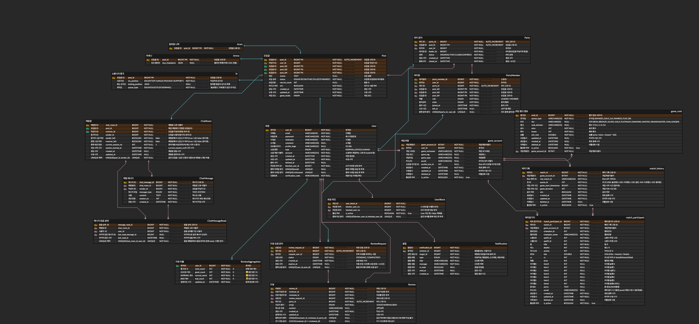

# 🎮 MatchMyDuo

> **데이터 신뢰성과 실시간성을 보장하는 파티 매칭 플랫폼**

게임 플레이어들이 쉽고 빠르게 듀오/파티를 찾을 수 있는 웹 플랫폼입니다.

🔗 **[서비스 바로가기](https://matchmyduo.shop/)** | 📄 **[API 문서](https://api.matchmyduo.shop/swagger-ui/index.html)**

<br/>

## ✨ 핵심 기능

### 1. 실시간 상태 동기화
파티원의 입장, 퇴장, 강퇴 및 모집 인원 변경 시 모집글의 상태(`RECRUIT` ↔ `ACTIVE`)가 즉각적으로 자동 전환되어 **'허위 매물'을 원천 차단**합니다.

### 2. 데이터 기반 신뢰 검증
**1유저 1게임 계정 연동 정책**을 통해 계정 도용을 방지하고, 라이엇 API를 활용한 전적 분석(최근 20경기 승률, KDA, 선호 챔피언) 데이터를 제공하여 매칭의 신뢰도를 높였습니다.

### 3. 사전 검증 시스템
단순 신청이 아닌 **1:1 채팅 기반의 영입 프로세스**를 통해, 파티장이 채팅 이력과 전적을 확인한 후 멤버를 선별적으로 초대할 수 있는 구조를 갖췄습니다.

<br/>

## 🛠 기술 스택

### Backend


### Database & Cache


### Real-time Communication


### Infrastructure


### API Docs & External API


<br/>

## 📊 ERD



<br/>

## 🚀 실행 방법

### 1. 프로젝트 클론
```bash
git clone https://github.com/prgrms-web-devcourse-final-project/WEB7_9_FinalScreening_BE.git
cd WEB7_9_FinalScreening_BE
```

### 2. 환경 변수 설정
프로젝트 루트에 `.env` 파일을 생성하고 아래 환경 변수를 설정합니다.

```env
# Database
DB_NAME=matchduo_db
DB_USER=root
DB_PASSWORD=your_password

# Redis
REDIS_HOST=localhost
REDIS_PORT=6379
REDIS_PW=your_redis_password

# JWT
JWT_SECRET=your_jwt_secret_key

# Mail (Gmail SMTP)
MAIL_USERNAME=your_email@gmail.com
MAIL_PASSWORD=your_app_password

# Riot API
RIOT_API_KEY=your_riot_api_key
```

### 3. Docker로 MySQL & Redis 실행
```bash
docker-compose up -d
```

### 4. 애플리케이션 실행
```bash
./gradlew bootRun
```

### 5. API 문서 확인
- 로컬: `http://localhost:8080/swagger-ui/index.html`
- 배포: https://api.matchmyduo.shop/swagger-ui/index.html

<br/>

---

## 🧑‍💻 개발 기간 & 팀원

### **개발 기간**
> 2025.12.10 (수) 09:00 ~ 2026.01.07 (수) 18:00

### **팀원**
| <a href="https://github.com/seopgyu"></a> | <a href="https://github.com/HongRae-Kim"></a> | <a href="https://github.com/kimwonmin"></a> | <a href="https://github.com/Boojw"></a> | <a href="https://github.com/ascal34"></a> | <a href="https://github.com/KyeongwonBang"></a> |
| :---: | :---: | :---: | :---: | :---: | :---: |
| **김규섭** | **김홍래** | **김원민** | **부종우** | **조영주** | **방경원** |
| PO | 팀장 | 팀원 | 팀원 (중도 하차) | 팀원 | 팀원 |

<br/>

---

## 📌 프로젝트 소개

### 기획 의도
- 사용자들이 원하는 게임의 파티를 빠르게 찾고, 실력 및 성향이 맞는 유저들과 함께 게임을 진행할 수 있도록 하는 **커뮤니케이션 공간**을 제공하고자 합니다.
- 파티원 모집 전, 모집을 신청한 유저들과 **채팅을 통해 미리 대화**를 나눠볼 수 있는 환경을 제공하여 원하는 파티원을 찾는데 도움을 드립니다.
- 게임별 특성과 유저 데이터를 기반으로 **안정적인 협업 환경**을 만들고자 합니다.

### 핵심 가치
| 🎯 게임별 맞춤 매칭 | 💬 실시간 소통 | 🤝 신뢰할 수 있는 파트너 찾기 |
|:---:|:---:|:---:|

### 타겟 사용자
**듀오/파티를 찾고 싶은 게임 유저**

<br/>

---

## 📋 컨벤션

### 🔄 작업 순서

1. **이슈 생성** → 작업 단위 정의
2. **브랜치 생성** → main 브랜치에서 이슈별 작업 브랜치 생성
3. **Commit & Push**
4. **PR 생성 & 코드 리뷰** → 최소 2명 승인 필요
5. **Merge & 브랜치 정리**
    - 리뷰 완료 후 main 브랜치로 Merge
    - Merge 후 이슈별 작업 브랜치 삭제

---

### 📌 네이밍 규칙

| 구분 | 네이밍 예시 | 내용 |
| --- | --- | --- |
| 이슈 이름 | [FE/feat] 로그인 기능 추가 | 영역 + 목적 + 설명 |
| 브랜치 이름 | feat/#12/login-api | type + issue-number + 설명 |
| 커밋 메시지 | feat(auth): JWT 기반 인증 구현 | type(scope): subject |
| PR 이름 | [FE/feat] 로그인 기능 추가 | 이슈명과 동일하게 작성 권장 |

1. **이슈 네이밍 규칙**
    - 제목 규칙 : `[작업영역/목적] 설명`
    - 예시 : `[BE/fix] 상품 목록 조회 오류 수정`
    - 본문은 템플릿에 맞춰서 작성

2. **브랜치 네이밍 규칙**
    - 생성 기준 : `main` 브랜치에서 생성
    - 명명 규칙  : `타입/#이슈번호/설명`
    - 예시: `feat/#12/login-api`

3. **PR 네이밍 규칙**
    - 제목 규칙 : `[작업영역/목적] 설명`
    - 예시 : `[BE/feat] 로그인 기능 추가`
    - 본문은 **📄 PR 템플릿**에 맞춰서 작성 + close #이슈넘버

4. **커밋 메시지 네이밍 규칙**
    - `타입(범위) : 작업내용`
    - 예시: `fix(order): 결제 버그 수정`

    | 타입 | 설명 |
    | --- | --- |
    | BE | Backend 작업 |
    | `feat` | 새로운 기능 추가 |
    | `fix` | 버그 수정 |
    | `docs` | 문서 수정 (README.md, API 문서 등) |
    | `style` | 코드 포맷팅, 세미콜론 누락 등 (코드 로직 변경 없음) |
    | `refactor` | 코드 리팩토링 (기능 변경 없음) |
    | `test` | 테스트 코드 추가 또는 수정 |
    | `chore` | 빌드 스크립트, 패키지 매니저 설정 등 기타 변경 사항 |
    | `rename` | 파일 혹은 폴더명을 수정하거나 옮기는 작업만인 경우 |
    | `remove` | 파일을 삭제하는 작업만 수행한 경우 |
    | `init` | 초기 생성, 꼭 필요한 라이브러리 설치하는 경우 |