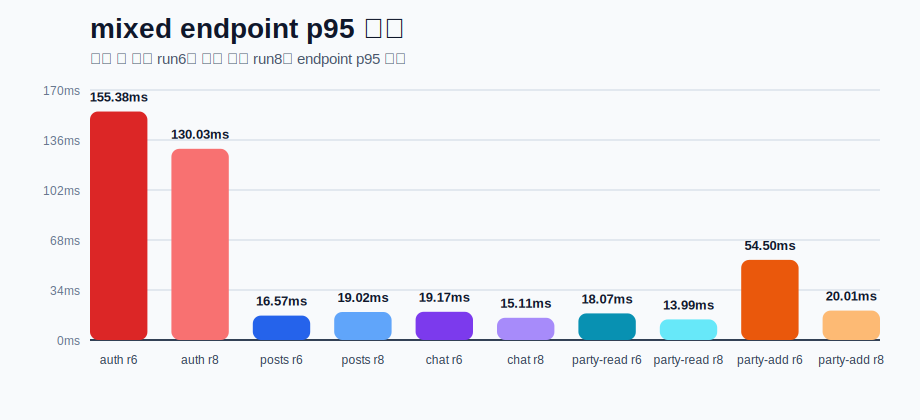
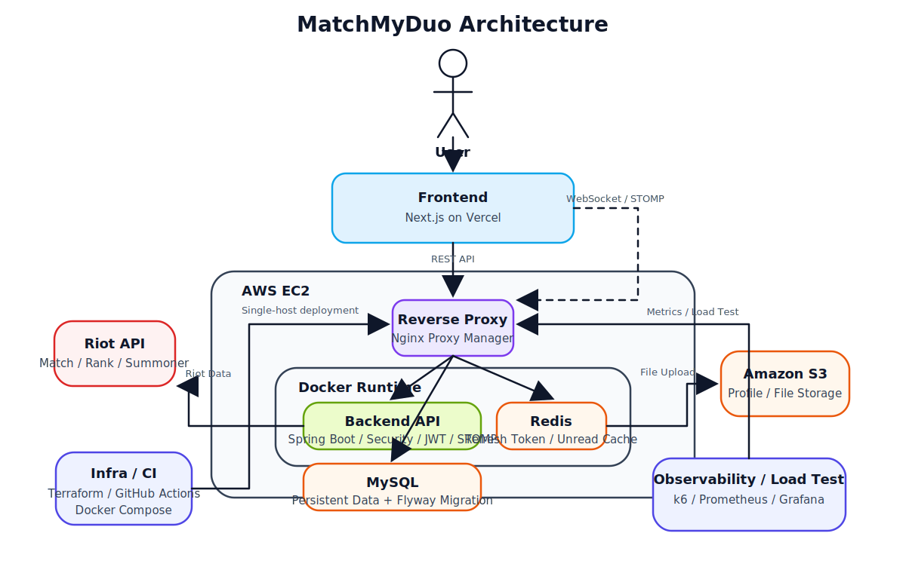
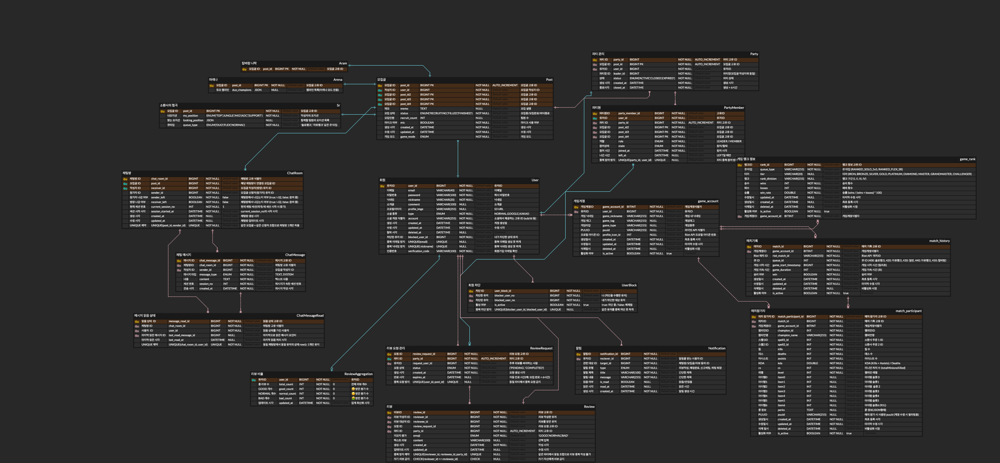

## 프로젝트 소개

**MatchMyDuo**는 게임 유저가 원하는 포지션과 성향에 맞는 듀오/파티를 찾을 수 있도록 돕는 매칭 웹 서비스입니다.

기존 모집글 서비스의 문제점:
- 모집이 끝났는데도 계속 노출되는 경우
- 지원자에 대한 정보가 부족해 신뢰가 떨어지는 경우
- 파티 참가 전 대화 수단이 없어 검증이 어려운 경우

이를 해결하기 위해 다음 방향으로 기획했습니다:
- 파티 상태와 모집글 상태를 **실시간으로 동기화**
- Riot API 기반 **전적/챔피언 데이터 제공**
- 1:1 채팅 후 파티장이 **직접 초대하는 구조**

| 🎯 게임별 맞춤 매칭 | 💬 실시간 소통 | 🤝 신뢰할 수 있는 파트너 찾기 |
|:---:|:---:|:---:|

🔗 **[서비스 바로가기](https://matchmyduo.shop/)** | 📄 **[API 문서](https://api.matchmyduo.shop/swagger-ui/index.html)** | 📊 **[부하테스트 보고서](load-test/README.md)**

---

## 개발 기간 & 팀원

**개발 기간** : 2025.12.10 (수) ~ 2026.01.07 (수)

| <a href="https://github.com/seopgyu"></a> | <a href="https://github.com/HongRae-Kim"></a> | <a href="https://github.com/kimwonmin"></a> | <a href="https://github.com/Boojw"></a> | <a href="https://github.com/ascal34"></a> | <a href="https://github.com/KyeongwonBang"></a> |
| :---: | :---: | :---: | :---: | :---: | :---: |
| **김규섭** | **김홍래** | **김원민** | **부종우** | **조영주** | **방경원** |
| PO | 팀장 | 팀원 | 팀원 | 팀원 | 팀원 |

---

## 핵심 기능

### 1. 실시간 상태 동기화
- 파티원 입장, 퇴장, 강퇴 시 모집글의 상태를 기반으로 동기화되며, 모집 인원이 다 차면 `RECRUIT → ACTIVE`, 빠지면 `ACTIVE → RECRUIT` 상태로 변경됩니다.

### 2. 신뢰 기반 유저 검증
- 한 유저당 1계정 연동을 통한 신뢰도를 확보하고, Riot API를 통해 최근 전적, KDA, 선호 챔피언 등 실제 플레이 데이터를 확인할 수 있습니다.

### 3. 1:1 채팅 기반 초대 프로세스
- 파티에 참가하고 싶은 지원자는 채팅을 통해 파티에 들어갈 수 있고, 파티장은 지원자의 채팅과 전적을 통해 초대할 수 있습니다.

---

## 기여한 내용

<details>
<summary>팀 프로젝트를 기반으로 fork 후 부하테스트를 단계별로 진행하면서 발생된 병목현상에 대해 개선했습니다.</summary>

### 1. 인증 로직 개선
- 기존 DB upsert 방식의 refresh token을 Redis에 저장하는 방식으로 변경, DB write 비용 제거
- `upsertRefreshToken`: 2~5ms → 0.003 ~ 0.016ms

### 2. 파티 초대 쓰기 로직 개선
- `party_add_members`에서 대상 유저별 개별 조회/저장 → 배치 조회 + `saveAll()` 구조로 변경
- `party_add_members p95`: 54.50ms → 20.01ms

### 3. 성능 테스트 및 병목현상 확인
- `k6`, `Prometheus`, `Grafana`를 통한 부하테스트 시나리오 구성
- 단일 API / mixed 테스트로 병목 식별 → 개선 → 동일 조건 재측정으로 효과 검증

### 4. 테스트 환경 수정
- 테스트 프로필을 H2 기반으로 수정해 외부 의존성 없이 로컬 테스트 가능
- Redis 저장소는 Testcontainers 기반 통합 테스트로 분리

### 최종 성능 (mixed_run8, stress 프로필)

| Endpoint | avg | p95 | Threshold | 결과 |
|----------|----:|----:|-----------|------|
| posts_list | 6.91ms | 19.02ms | p95 < 800ms | PASS |
| auth_login | 89.30ms | 130.03ms | p95 < 700ms | PASS |
| chat_rooms | 8.94ms | 20.66ms | p95 < 900ms | PASS |
| chat_messages | 6.77ms | 15.11ms | p95 < 1000ms | PASS |
| party_members | 6.10ms | 13.99ms | p95 < 800ms | PASS |
| party_add_members | 12.51ms | 20.01ms | p95 < 1200ms | PASS |

> 총 41,570 요청 / 171.2 req/s / 실패율 0.06% / **전체 Threshold PASS**



상세 내용: [부하테스트 및 병목 개선 보고서](load-test/README.md)
</details>

---

## 기술 스택

### Backend


### Database & Cache


### Real-time Communication


### Infrastructure


### Monitoring & Load Testing


### API Docs & External API


---

## 아키텍처

프런트엔드는 Vercel에 배포된 Next.js 애플리케이션이고, 백엔드는 AWS EC2 내부 Docker 런타임에서 Spring Boot API, MySQL, Redis를 함께 운영합니다.  
Reverse Proxy를 통해 REST API와 WebSocket/STOMP 요청을 전달하고, Riot API와 S3를 외부 서비스로 연동합니다.  
인프라는 Terraform으로 관리하고, k6, Prometheus, Grafana로 부하테스트와 모니터링을 구성했습니다.



---

## ERD



---

## 실행 방법

### 1. 프로젝트 클론
```bash
git clone https://github.com/HongRae-Kim/WEB7_9_FinalScreening_BE.git
cd WEB7_9_FinalScreening_BE
```

### 2. 환경 변수 설정

프로젝트에는 두 가지 설정 파일이 필요합니다.

#### `.env` (프로젝트 루트) — Docker Compose용

```env
DB_PASSWORD=your_db_password
REDIS_PASSWORD=your_redis_password
```

#### `application-secret.yml` (`src/main/resources/`) — Spring Boot용

```yaml
DB_NAME: matchduo_db
DB_USER: root
DB_PASSWORD: your_db_password

REDIS_HOST: localhost
REDIS_PORT: 6379
REDIS_PASSWORD: your_redis_password

JWT_SECRET: your_jwt_secret_key

MAIL_USERNAME: your_email@gmail.com
MAIL_PASSWORD: your_gmail_app_password

RIOT_API_KEY: your_riot_api_key

# prod 프로필에서만 사용
CUSTOM_PROD_DOMAIN: your_prod_domain
CUSTOM_PROD_BACK_URL: your_prod_back_url
CUSTOM_PROD_FRONT_URL: your_prod_front_url
```

| 변수 | 설명 | 필요 프로필 |
|------|------|------------|
| `DB_NAME` / `DB_USER` / `DB_PASSWORD` | MySQL 접속 정보 | dev, prod |
| `REDIS_HOST` / `REDIS_PORT` / `REDIS_PASSWORD` | Redis 접속 정보 | dev, prod |
| `JWT_SECRET` | JWT 토큰 서명 키 | 전체 |
| `MAIL_USERNAME` / `MAIL_PASSWORD` | Gmail SMTP (앱 비밀번호) | 전체 |
| `RIOT_API_KEY` | [Riot Developer Portal](https://developer.riotgames.com/)에서 발급 | 전체 |
| `CUSTOM_PROD_*` | 배포 도메인/URL 설정 | prod |

### 3. Docker로 MySQL & Redis 실행
```bash
docker compose up -d
```

### 4. 애플리케이션 실행
```bash
./gradlew bootRun
```

기본 프로필은 `dev`입니다. (`application.yml`의 `spring.profiles.active`)

### 5. API 문서 확인
- 로컬: `http://localhost:8080/swagger-ui/index.html`

### 프로필별 동작

| 프로필 | DB | DDL | Flyway | Redis | 용도 |
|--------|------|-----|--------|-------|------|
| `dev` | MySQL (localhost) | update | 비활성 | localhost | 로컬 개발 |
| `prod` | MySQL (Docker 내부) | validate | 활성 | Docker 내부 | 운영 배포 |
| `test` | H2 (in-memory) | create-drop | 비활성 | 미사용 | 테스트 |

---

## 컨벤션

<details>
<summary>코드 컨벤션</summary>

### 작업 순서

1. **이슈 생성** → 작업 단위 정의
2. **브랜치 생성** → main 브랜치에서 이슈별 작업 브랜치 생성
3. **Commit & Push**
4. **PR 생성 & 코드 리뷰** → 최소 2명 승인 필요
5. **Merge & 브랜치 정리** → Merge 후 작업 브랜치 삭제

### 네이밍 규칙

| 구분 | 규칙 | 예시 |
| --- | --- | --- |
| 이슈 | `[작업영역/목적] 설명` | `[BE/fix] 상품 목록 조회 오류 수정` |
| 브랜치 | `타입/#이슈번호/설명` | `feat/#12/login-api` |
| 커밋 | `타입(범위): 작업내용` | `feat(auth): JWT 기반 인증 구현` |
| PR | `[작업영역/목적] 설명` | `[BE/feat] 로그인 기능 추가` |

### 커밋 타입

| 타입 | 설명 |
| --- | --- |
| `feat` | 새로운 기능 추가 |
| `fix` | 버그 수정 |
| `docs` | 문서 수정 |
| `style` | 코드 포맷팅 (로직 변경 없음) |
| `refactor` | 코드 리팩토링 (기능 변경 없음) |
| `test` | 테스트 코드 추가 또는 수정 |
| `chore` | 빌드 스크립트, 패키지 매니저 등 기타 변경 |
| `rename` | 파일/폴더명 수정 또는 이동 |
| `remove` | 파일 삭제 |
| `init` | 초기 생성 |

</details>


