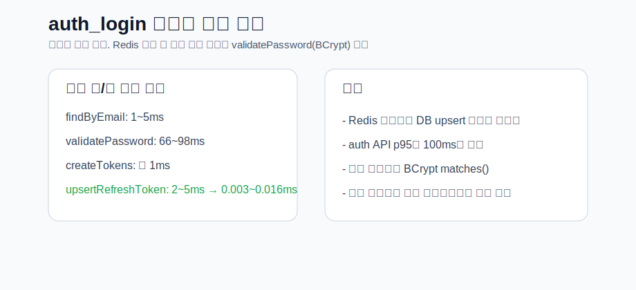
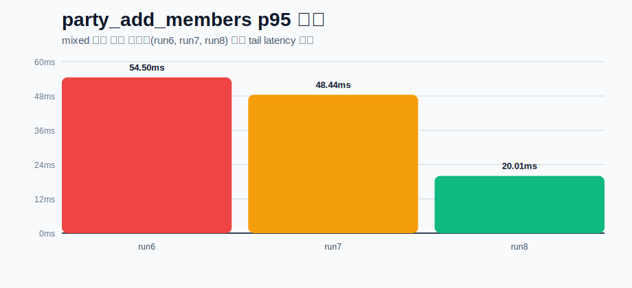

# 성능 테스트 및 병목 개선

> MatchMyDuo 백엔드의 주요 API를 대상으로 부하테스트를 수행하고, 병목 지점을 분석한 뒤 개선 전/후를 재측정한 기록입니다.

- 테스트 도구: `k6`, `Prometheus`, `Grafana`

## 테스트 목적
- 주요 API의 단일 성능과 혼합 부하 상황에서의 응답 특성을 확인한다.
- 실제 서비스에서 체감 성능에 영향을 줄 수 있는 병목 후보를 찾는다.
- 병목 후보를 개선한 뒤 동일하거나 유사한 조건에서 다시 측정해 개선 효과를 검증한다.

## 환경 정보
| 항목 | 내용 |
| --- | --- |
| Backend | Spring Boot |
| Database | MySQL |
| Cache | Redis |
| Load Tool | k6 |
| Monitoring | Prometheus, Grafana |
| 결과 저장 | `k6/results/*.json` |

## 시나리오
### 단일 API 테스트
- `posts_list_public`: 게시글 목록 조회
- `auth_login`: 로그인
- `chat_messages_read`: 채팅 메시지 조회
- `party_members_read`: 파티 멤버 조회

### 혼합 테스트
- `posts`
- `auth`
- `chat_rooms`
- `chat_messages`
- `party_members`
- `party_add_members`

혼합 테스트는 읽기 중심 시나리오와 쓰기 포함 시나리오를 구분해 진행했습니다.

## 주요 지표
| 지표 | 의미 |
| --- | --- |
| `RPS` | 초당 처리 요청 수 |
| `Avg Latency` | 전체 요청 평균 응답시간 |
| `p95 Latency` | 전체 요청의 95%가 이 시간 안에 끝난다는 의미 |
| `http_req_failed` | 실패 요청 비율 |
| `dropped_iterations` | 목표 부하를 k6가 끝까지 소화하지 못한 횟수 |

## 핵심 결과 요약
### 단일 API
| 시나리오 | Run ID | 처리량(req/s) | endpoint p95 | 실패율 |
| --- | --- | ---: | ---: | ---: |
| Posts baseline | `posts_baseline_run1` | 67.64 | 22.68ms | 0% |
| Posts high-2 | `posts_high_run2` | 137.94 | 15.13ms | 0% |
| Auth stress | `auth_stress_run4` | 26.31 | 125.85ms | 0% |
| Chat high-3 | `chat_messages_high_run3` | 94.56 | 53.29ms | 0% |
| Party members high | `party_members_high_run1` | 46.94 | 84.33ms | 0% |

해석:
- `posts`, `chat`, `party_members`는 단일 API 기준에서 큰 병목 없이 안정적으로 동작했습니다.
- `auth_login`은 단일 API 중 가장 무거웠지만 실패 없이 안정적으로 처리됐습니다.

### 혼합 테스트
| Run ID | 처리량(req/s) | 전체 p95 | auth p95 | party_add_members p95 | 결과 |
| --- | ---: | ---: | ---: | ---: | --- |
| `mixed_run6` | 171.29 | 18.76ms | 155.38ms | 54.50ms | `party_add_members` 20/20 성공 |
| `mixed_run8` | 171.20 | 21.49ms | 130.03ms | 20.01ms | `party_add_members` 20/20 성공 |

해석:
- mixed 환경에서는 `auth_login`과 `party_add_members`가 상대적으로 무거운 API로 확인됐습니다.
- 읽기 API는 mixed stress에서도 대체로 안정적이었습니다.

## 병목 원인 분석
### 1. `auth_login`
`auth_login_timing` 로그로 단계별 비용을 분리해 확인했습니다.

- `findByEmail`: 대체로 1~5ms
- `validatePassword`: 대체로 66~98ms
- `createTokens`: 약 1ms
- `upsertRefreshToken`: Redis 전환 후 0.003~0.016ms

결론:
- 기존 DB 기반 refresh token upsert 비용은 제거됐습니다.
- 남은 주요 비용은 `BCrypt passwordEncoder.matches()`로, 보안상 의도된 연산 비용입니다.
- 따라서 `auth_login`은 불필요한 병목은 제거됐고, 남은 지연은 보안 트레이드오프 관점에서 해석하는 것이 맞습니다.

### 2. `party_add_members`
개선 전에는 초대 대상 수만큼 개별 조회와 개별 저장이 반복되어 요청당 쿼리 수가 많았습니다.

개선 후에는 다음 구조로 변경했습니다.
- `findAllByPartyIdAndUserIdIn(...)` 배치 조회
- `userRepository.findAllById(...)` 배치 조회
- `saveAll(...)` 배치 저장

결론:
- 쓰기 경합이 포함된 mixed 환경에서도 정상 처리(`20/20`)를 유지했습니다.
- 개선 후 `party_add_members p95`가 유의미하게 내려가 안정화 신호를 확인했습니다.

## 개선 전/후 비교
### `auth_login`
| 항목 | 변경 전 | 변경 후 | 해석 |
| --- | ---: | ---: | --- |
| `upsertRefreshToken` | 2~5ms | 0.003~0.016ms | Redis 전환으로 DB write 비용 제거 |
| `validatePassword` | 66~98ms | 66~98ms | BCrypt 검증 비용은 유지 |
| `auth_stress endpoint p95` | 109.28ms (`run3`) | 125.85ms (`run4`) | API 전체 p95는 큰 개선 없음 |

### `party_add_members`
| 항목 | 개선 전 (`mixed_run6`) | 개선 후 (`mixed_run8`) | 변화 |
| --- | ---: | ---: | --- |
| `avg` | 18.86ms | 12.51ms | 개선 |
| `p95` | 54.50ms | 20.01ms | 개선 |
| `max` | 86.33ms | 59.45ms | 개선 |
| 처리 결과 | 20 pass / 0 fail | 20 pass / 0 fail | 유지 |

## 대시보드 스크린샷 / 비교 시각화
실제 Grafana 대시보드 기반으로 해석한 비교 결과를 차트 형태로 정리했습니다.

## 최종 정리
- 주요 읽기 API는 병목으로 보기 어려운 수준으로 안정적이었습니다.
- `auth_login`은 혼합 부하에서 가장 무거운 API였지만, 남은 비용은 대부분 BCrypt 검증입니다.
- `party_add_members`는 배치 처리 적용 후 개선 효과를 확인했습니다.
- 이번 작업에서는 병목 탐지 -> 원인 분석 -> 1차 개선 -> 재측정 검증까지 완료했습니다.
